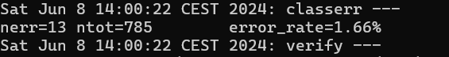

PAV - P4: reconocimiento y verificación del locutor
===================================================
 
Obtenga su copia del repositorio de la práctica accediendo a [Práctica 4](https://github.com/albino-pav/P4)
y pulsando sobre el botón `Fork` situado en la esquina superior derecha. A continuación, siga las
instrucciones de la [Práctica 2](https://github.com/albino-pav/P2) para crear una rama con el apellido de
los integrantes del grupo de prácticas, dar de alta al resto de integrantes como colaboradores del proyecto
y crear la copias locales del repositorio.
 
También debe descomprimir, en el directorio `PAV/P4`, el fichero [db_8mu.tgz](https://atenea.upc.edu/mod/resource/view.php?id=3654387?forcedownload=1)
con la base de datos oral que se utilizará en la parte experimental de la práctica.
 
Como entrega deberá realizar un *pull request* con el contenido de su copia del repositorio. Recuerde
que los ficheros entregados deberán estar en condiciones de ser ejecutados con sólo ejecutar:
 
~~~~~~~~~~~~~~~~~~~~~~~~~~~~~~~~~~~~~~~~~~~~~~~~~~~~~.sh
  make release
  run_spkid mfcc train test classerr verify verifyerr
~~~~~~~~~~~~~~~~~~~~~~~~~~~~~~~~~~~~~~~~~~~~~~~~~~~~~
 
Recuerde que, además de los trabajos indicados en esta parte básica, también deberá realizar un proyecto
de ampliación, del cual deberá subir una memoria explicativa a Atenea y los ficheros correspondientes al
repositorio de la práctica.
 
A modo de memoria de la parte básica, complete, en este mismo documento y usando el formato *markdown*, los
ejercicios indicados.
 
## Ejercicios.
 
### SPTK, Sox y los scripts de extracción de características.
 
- Analice el script `wav2lp.sh` y explique la misión de los distintos comandos involucrados en el *pipeline*
  principal (`sox`, `$X2X`, `$FRAME`, `$WINDOW` y `$LPC`). Explique el significado de cada una de las 
  opciones empleadas y de sus valores.
 El script `wav2lp.sh` se utiliza para la extracción de características de audio utilizando diversas herramientas como `sox` y las utilidades de SPTK.
 
  #### Misión de los Comandos Involucrados en el Pipeline Principal
 
  1. **Sox**:
     - **Misión**: `sox` convierte el archivo de audio `inputfile` en un flujo de datos en bruto (raw) de 16 bits.
     - **Opciones**:
       - `-t raw`: Especifica que la salida debe ser en formato raw.
       - `-e signed`: Especifica que los datos son firmados.
       - `-b 16`: Especifica que cada muestra tiene 16 bits.
 
  2. **X2X**: 
     - **Misión**: `x2x` convierte los datos de entrada a float de 4 bytes..
     - **Opciones**:
       - `+sf`: Convierte datos de tipo `float` a `short`.
 
  3. **Frame**: 
     - **Misión**: `frame` divide la señal en tramas de longitud fija.
     - **Opciones**:
       - `-l 240`: Longitud de la trama en muestras.
       - `-p 80`: Desplazamiento entre tramas consecutivas.
 
  4. **Window**:
     - **Misión**: `window` aplica una ventana a cada trama para suavizar los bordes.
     - **Opciones**:
       - `-l 240`: Longitud de la ventana input.
       - `-L 240`: Longitud de la ventana output.
 
  5. **LPC**: 
     - **Misión**: `lpc` calcula los coeficientes de predicción lineal (LPC) para cada trama.
     - **Opciones**:
       - `-l 240`: Longitud de la trama.
       - `-m $lpc_order`: Orden del análisis LPC.
 
- Explique el procedimiento seguido para obtener un fichero de formato *fmatrix* a partir de los ficheros de
  salida de SPTK (líneas 45 a 51 del script `wav2lp.sh`).
  1. **Calculando el Número de Filas y Columnas**:
       - `ncol=$((lpc_order+1))`: Calcula el número de columnas como el orden LPC más uno.
       - `nrow=`$X2X +fa < $base.lp | wc -l | perl -ne 'print $_/'$ncol', "\n";'`: Calcula el número de filas dividiendo el número total de elementos por el número de columnas.
 
    2. **Construyendo el Fichero `fmatrix`**:
       - `echo $nrow $ncol | $X2X +aI > $outputfile`: Escribe el número de filas y columnas en el archivo de salida `outputfile`.
       - `cat $base.lp >> $outputfile`: Añade los datos LPC calculados al archivo de salida `outputfile`.
 
  * ¿Por qué es más conveniente el formato *fmatrix* que el SPTK?
 
    El formato `fmatrix` es más conveniente porque permite trabajar con una señal organizada y estructurada en tramas. En fmatrix, cada columna representa los coeficientes LPC y cada fila corresponde a una trama. Este formato facilita el trabajo con los dato
 
- Escriba el *pipeline* principal usado para calcular los coeficientes cepstrales de predicción lineal
  (LPCC) en su fichero <code>scripts/wav2lpcc.sh</code>:
 
  ```sh
  sox $inputfile -t raw -e signed -b 16 - | $X2X +sf | $FRAME -l 240 -p 80 | $WINDOW -l 240 -L 240 | $LPC -l 240 -m $lpc_order | $LPCC -m $lpc_order -M $lpcc_order > $base.lpcc || exit 1
 
- Escriba el *pipeline* principal usado para calcular los coeficientes cepstrales en escala Mel (MFCC) en su
  fichero <code>scripts/wav2mfcc.sh</code>:
 
  ```sh
  sox $inputfile -t raw -e signed -b 16 - | $X2X +sf | $FRAME -l 240 -p 80 | $WINDOW -l 240 -L 240 | $MFCC -m $mfcc_order -n $mel_filter_order > $base.lp || exit 1
 
 
### Extracción de características.
 
- Inserte una imagen mostrando la dependencia entre los coeficientes 2 y 3 de las tres parametrizaciones
  para todas las señales de un locutor.
 
  + Indique **todas** las órdenes necesarias para obtener las gráficas a partir de las señales 
    parametrizadas.
 
   ### -LP:
  ```bash
  plot_gmm_feat -x 2 -y 3 -g green work/gmm/lp/SES003.gmm work/lp/BLOCK00/SES003/*
  ```
    
 
   ### -LPCC:
    ```bash
  plot_gmm_feat -x 2 -y 3 -g green work/gmm/lpcc/SES003.gmm work/lpcc/BLOCK00/SES003/*
  ```
    
   ### -MFCC:
 
  ```bash
  plot_gmm_feat -x 2 -y 3 -g green work/gmm/mfcc/SES003.gmm work/mfcc/BLOCK00/SES003/*
  ```
    
 
  + ¿Cuál de ellas le parece que contiene más información?
Cuanto menos correladas estén, más información obtendremos. Queremos la mayor dispresión de los puntos.
Los datos en la LP están más correlados, sin embargo, podemos observar mayor dispresión, por lo tanto, mayor incorrelación, en las gráficas de LPCC y MFCC.
- Usando el programa <code>pearson</code>, obtenga los coeficientes de correlación normalizada entre los
  parámetros 2 y 3 para un locutor, y rellene la tabla siguiente con los valores obtenidos.
 
  |                        | LP      | LPCC   |   MFCC |
  |------------------------|:-------:|:------:|:------:|
  | &rho;<sub>x</sub>[2,3] | -0.555  | 0.298  |  0.335 |
 
    
    
    
  + Compare los resultados de <code>pearson</code> con los obtenidos gráficamente.
 
- Según la teoría, ¿qué parámetros considera adecuados para el cálculo de los coeficientes LPCC y MFCC?
Los LPCC y MFCC suelen tener al rededor de 13 coeficientes, mientras que trabajando con MFCC, se toman entre 24 y 40 filtros.
 
### Entrenamiento y visualización de los GMM.
 
Complete el código necesario para entrenar modelos GMM.
 
- Inserte una gráfica que muestre la función de densidad de probabilidad modelada por el GMM de un locutor
  para sus dos primeros coeficientes de MFCC.
  
    
  
- Inserte una gráfica que permita comparar los modelos y poblaciones de dos locutores distintos (la gŕafica
  de la página 20 del enunciado puede servirle de referencia del resultado deseado). Analice la capacidad
  del modelado GMM para diferenciar las señales de uno y otro.
  
     
     
 
### Reconocimiento del locutor.
 
Complete el código necesario para realizar reconociminto del locutor y optimice sus parámetros.
 
- Inserte una tabla con la tasa de error obtenida en el reconocimiento de los locutores de la base de datos
  SPEECON usando su mejor sistema de reconocimiento para los parámetros LP, LPCC y MFCC.
 
  | Caract | Error rate    |
  |--------|---------------|
  | LP     | 11.20%        |
  | LPCC   | 0.38%         |
  | MFCC   | 1.66%         |



### Verificación del locutor.
 
Complete el código necesario para realizar verificación del locutor y optimice sus parámetros.
 
- Inserte una tabla con el *score* obtenido con su mejor sistema de verificación del locutor en la tarea
  de verificación de SPEECON. La tabla debe incluir el umbral óptimo, el número de falsas alarmas y de
  pérdidas, y el score obtenido usando la parametrización que mejor resultado le hubiera dado en la tarea
  de reconocimiento.
  
| Método | Umbral óptimo | Falsas Alarmas | Pérdidas | Cost Detection            |
|--------|---------------|----------------|----------|---------------------------|
| LP     | 0.4036        | 32/1000        | 75 /250  | 58.8                      |
| LPCC   | 1.463         | 5/1000         | 25/250   | 14.5                      |
| MFCC   | 1.559         | 10/1000        | 39/250   | 24.6                      |

  LP:
  
 
  LPCC:
  
 
  MFCC:
  
 
### Test final
 
- Adjunte, en el repositorio de la práctica, los ficheros `class_test.log` y `verif_test.log` 
  correspondientes a la evaluación *ciega* final.
 
### Trabajo de ampliación.
 
- Recuerde enviar a Atenea un fichero en formato zip o tgz con la memoria (en formato PDF) con el trabajo 
  realizado como ampliación, así como los ficheros `class_ampl.log` y/o `verif_ampl.log`, obtenidos como 
  resultado del mismo.
